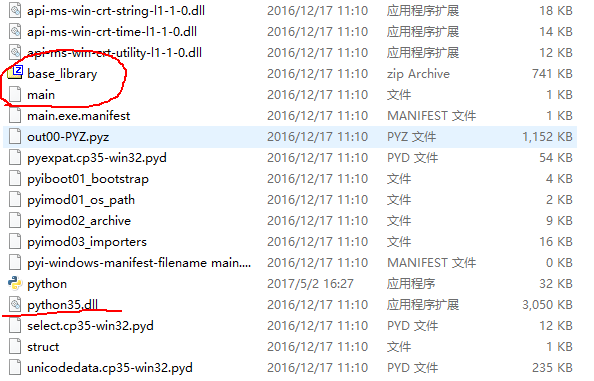
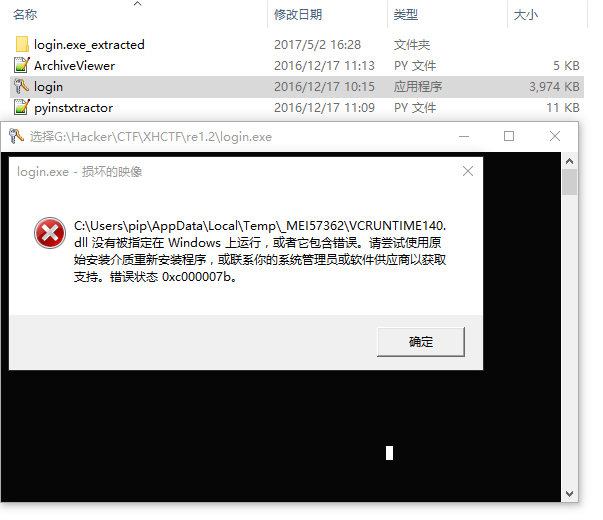
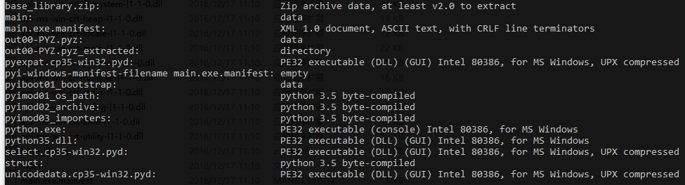

# Login
本题为2016年下半年湖湘杯一道逆向。
从本思路处理，需要一定的python虚拟机知识，和python打包逆向的知识。
本题的所有命令都在git-shell下执行，兼容类unix。

## 预处理

<login.exe>文件可以从[这里下载](https://dn.jarvisoj.com/challengefiles/login.exe.0e043cc84e9273f1e34b6b27330c8e5a) 

使用[pyinstaller extractor](https://sourceforge.net/projects/pyinstallerextractor/) 提取器，会有很多文件，我们关注这个文件：main <.pyc>。



这个主文件是一个pyObject转储的字符串文件,pyObj相关的资料大家可以看python的文档，也可以看看源代码剖析。
将其转换为正常的pycfile（添加一个pyc文件头，4字节MAGIC_NUMBER，4bytes Timestamp），用uncompyle6 将其反向到源代码：
```python
# Embedded file name: main.py
# Compiled at: 2016-08-16 19:36:25
# Size of source mod 2**32: 89 bytes
import hxbctf
print(hxbctf.Login(0, input('UserName: ')))
# okay decompiling tryrepair.main.pyc
```

## 本身的Bug
点击运行这个exe,会提示无法运行，放进虚拟机里也是一个德行，当时做题的时候真是x了狗了。



在网上搜索了一阵子，发现这个使用Onefile参数压缩的pyinstaller bootloader有一个奇怪的[bug](https://github.com/pyinstaller/pyinstaller/issues/1565) ，主要是由vc运行库的压缩引发的。当vcruntime被upx压缩时在64位Windows下无法运行，这可能会导致一些错误，比如一直弹无法找到dll。
知道错误就好办了，参考pyinstaller打包文件的[格式](https://pythonhosted.org/PyInstaller/advanced-topics.html) 是n个文件直接二进制append的类型，所以只要修改索引表Table of Contents就好了。


现在我们使用010editor来更改login.exe文件中,执行`strings login.exe |grep dll`字符串搜索，找到字符串`bVCRUNTIME140.dll`的位置，并将其重命名为`bccruntime140.dll`或者任何其他字符串以绕过此错误。记得在系统的搜索路径下放置一个 VCRUNTIME140.dll文件。

## 仔细分析
首先`file *`所有文件，看看有什么，很明显的一条是upx-compressed.


用`ls *.dll |xargs upx -d `解压缩这些文件。

如果我们在所有二进制文件被upx解压缩之后使用`strings hxbctf`进行搜索，会发现“python.dll”报告了一个字符串引用hxbctf。这里的技巧是充分利用shell提供的工具快速在目录里搜索，否则一个文件一个文件找就累死人了。

这里已经很清楚了，下一步逆核心dll。


## Crack
一般逆向就几步走，找关键词，定位代码，分析逻辑。

如果使用 python 前端shell python.exe来运行核心DLL，会发现hxbctf已经被编译成这个python core文件中的内置模块。

拉进IDA,Shift+F12看字符串。
幸运的是，字符串“Congratulations”是.rodata段中的一个纯文本。
按下X反查使用点，很快就能找到他的使用位置，只有一处：

在dll，段位置.text:1E183D20，按F5 直接看C代码，这是主要功能：
```c
//已修改注释和部分变量名
int __cdecl coreCTFfunction(int a1, void *pyobj)
{
  int result; // eax@1
  int i; // edx@5
  int v4; // eax@6
  int v5; // ecx@6
  char *userName; // [sp+4h] [bp-40Ch]@2
  int paraNumber1; // [sp+8h] [bp-408h]@1
  char Dst; // [sp+Ch] [bp-404h]@8
  char inputStrDstcache[512]; // [sp+20Ch] [bp-204h]@1

  memset(inputStrDstcache, 0, 0x200u);
  result = PyArg_ParseTuple(pyobj, "is", (unsigned int)&paraNumber1);// http://wiki.jikexueyuan.com/project/interpy-zh/c_extensions/python_c_api.html
  if ( result )
  {
    sub_1E04E550((int)"Password: ", (char)userName);
    getInputScanf("%s", inputStrDstcache);
    if ( paraNumber1 == 0x1352 && strlen(inputStrDstcache) == 16 && !strncmp("HXB_Admin", userName, 9u) )
    {
      i = 0;
      while ( 1 )
      {
        v4 = inputStrDstcache[i];
        v5 = i ^ v4 ^ secrectKey[i];
        if ( i != (v4 ^ secrectKey[i]) )
          break;
        if ( ++i >= 16 )
        {
          memset(&Dst, v5, 0x200u);
          printfFormator(&Dst, "Congratulations!\nflag{%s}.", inputStrDstcache);
          return Py_BuildValue("s", (unsigned int)&Dst);
        }
      }
    }
    result = Py_BuildValue("s", (unsigned int)"Access Denied!");
  }
  return result;
}
```

找出secKey中的字符串：`.rdata:1E253040 secrectKey`

这里是算法：Xor与每个输入的char和他的索引;
```python
sec='Pxvk4kYcIVlJSeO?'
res=[]
for i in range(len(sec)):
    n1=ord(sec[i])
    res.append(chr(i^n1))
print(''.join(res))
## -- End pasted text --
#got >>>Pyth0n_dA_fA_hA0
```

## 结果
在一个python shell里执行：
```python
import hxbctf
>>> hxbctf.Login(0x1352,'HXB_Admin')
Password: Pyth0n_dA_fA_hA0
'Congratulations!\nflag{Pyth0n_dA_fA_hA0}.'
>>> 
```
我们已经得到了我们想要的了

# 总结
题目核心其实非常简单，但是在64bit下的bug平添巨大的麻烦。就虚拟机本身而言，题目隐藏得还是不错的，如果动态解密字符串的话。相似的题目还有2017年出的更加暴力的西安的SSCTF的bpython。


# 参考

- 强行动态调试解出，这个很暴力：http://bbs.pediy.com/thread-215002.htm 
- python 源代码剖析这本书